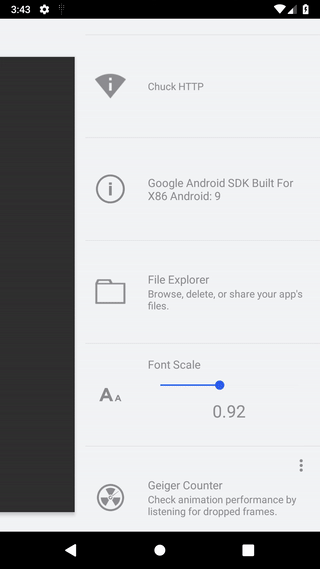

# FoQA


Container for various Quality Assurance utilities to be included in QA/testing variants of Android apps.

## Description

Integrate various Quality Assurance tools into Android application by adding just one line to `build.gradle`.
FoQA [Hyperion](https://github.com/willowtreeapps/Hyperion-Android) plugins can also be used separately.

## Usage

Add FoQA dependency to `build.gradle` of the application module:

```groovy
dependencies {
    debugImplementation 'com.github.droidsonroids:foqa:0.0.9'
}
```

If not already present add Maven Central repository:
```groovy
repositories {
    mavenCentral()
}
```

## Contents

- [Hyperion](https://github.com/willowtreeapps/Hyperion-Android) with core plugins
- [Hyperion App Info](https://github.com/willowtreeapps/Hyperion-Android)
- [Android Debug Database](https://github.com/amitshekhariitbhu/Android-Debug-Database)
- Hyperion menu item with Device market name [Hyperion Device Info](#device-info-plugin)
- Hyperion menu item with font scale changer [Hyperion Font Scale](#font-scale-plugin)
- Hyperion menu item with Chuck launcher [Hyperion FoQA Chuck](#chuck-plugin)

See [build.gradle](library/build.gradle) for a complete list of components. And [build.gradle](build.gradle) for versions.

## FoQA Hyperion plugins

### Device Info plugin

Shows device market name and Android version.


### Usage

```groovy
dependencies {
    debugImplementation 'pl.droidsonroids.foqa:deviceinfo:0.0.9'
}
```

### Font Scale plugin

Allows to quickly change system font scale in range from `0.4` to `1.6`.
System settings write prompt will appear when setting scale for the first time. 



### Usage

```groovy
dependencies {
    debugImplementation 'pl.droidsonroids.foqa:fontscale:0.0.9'
}
```
### Chuck plugin

Allows to quickly launch [Chuck](https://github.com/jgilfelt/chuck).
Based on [Hyperion Chuck](https://github.com/Commit451/Hyperion-Chuck)
which cannot be used if FoQA is published to MavenCentral repo.
We'll deprecate this plugin after Hyperion Chuck becomes [compatible with MavenCentral](https://github.com/Commit451/Hyperion-Chuck/issues/1).    

### Usage

```groovy
dependencies {
    debugImplementation 'pl.droidsonroids.foqa:chuck:0.0.9'
}
```

## License

MIT License